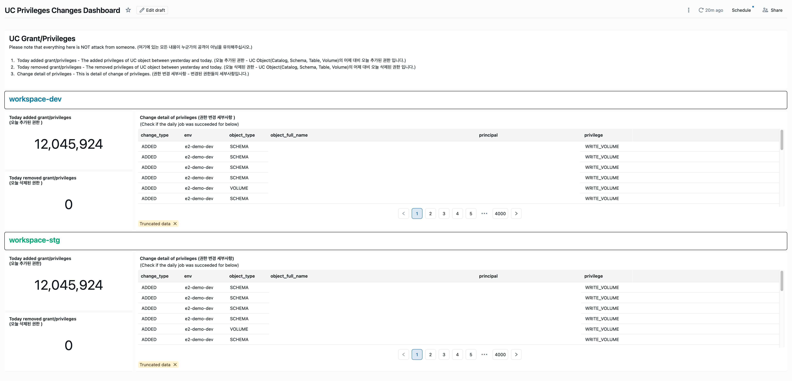

# UC Privileges Check

Unity Catalog 권한(Grants) 변경 사항을 일별로 스냅샷하고, 전일 대비 권한 변동(Drift)을 자동 감지하는 Databricks Asset Bundle 프로젝트입니다.

## Overview

조직 내 Unity Catalog 객체(Catalog, Schema, Table, Volume)에 부여된 권한을 매일 수집하여 Delta 테이블에 적재하고, 전일 스냅샷과 비교하여 **추가(ADDED)** 또는 **삭제(REMOVED)** 된 권한을 자동으로 탐지합니다.

## Architecture

```
system.information_schema
  ├── catalog_privileges
  ├── schema_privileges          ┌─────────────────────────┐
  ├── table_privileges    ──────▶│  uc_grants_snapshot     │──┐
  └── volume_privileges          │  (Daily append-only)    │  │  Compare
                                 └─────────────────────────┘  │  today vs yesterday
                                                              ▼
                                 ┌─────────────────────────┐
                                 │  uc_grants_drift        │
                                 │  (ADDED / REMOVED)      │
                                 └─────────────────────────┘
```

## Job Pipeline

Databricks Workflow로 구성된 2단계 순차 실행 파이프라인입니다.

| Task | Notebook | Description |
|------|----------|-------------|
| **Task 1** | `01. CREATE UC_GRANT_SNAPSHOT TABLE` | `uc_grants_snapshot` 테이블을 생성하고, `information_schema`의 4개 privileges 뷰(catalog/schema/table/volume)에서 현재 권한 정보를 수집하여 INSERT |
| **Task 2** | `02. SELECT AND CREATE TABLES of ALL PRIVILEGES` | `uc_grants_drift` 테이블을 생성하고, 오늘 스냅샷과 전일 스냅샷을 `LEFT ANTI JOIN`으로 비교하여 ADDED/REMOVED 변경분을 INSERT |

## Table Schemas

### `uc_grants_snapshot` (권한 스냅샷)

| Column | Type | Description |
|--------|------|-------------|
| `snapshot_date` | DATE | 스냅샷 파티션 날짜 (UTC) |
| `snapshot_ts` | TIMESTAMP | 스냅샷 타임스탬프 |
| `env` | STRING | 환경 라벨 (DEV/STG/PRD) |
| `workspace_id` | STRING | Databricks Workspace ID |
| `object_type` | STRING | 객체 유형 (CATALOG, SCHEMA, TABLE, VOLUME) |
| `object_full_name` | STRING | 정규화된 객체 이름 (e.g., `` `cat`.`sch`.`tbl` ``) |
| `principal` | STRING | 권한 수혜자 (user/group/service principal) |
| `privilege` | STRING | 권한 유형 (SELECT, USE_SCHEMA, OWN, MODIFY 등) |

### `uc_grants_drift` (권한 변동 감지)

| Column | Type | Description |
|--------|------|-------------|
| `drift_date` | DATE | 변동 감지 날짜 |
| `change_type` | STRING | 변동 유형: `ADDED` or `REMOVED` |
| `object_type` | STRING | 객체 유형 |
| `object_full_name` | STRING | 정규화된 객체 이름 |
| `principal` | STRING | 권한 수혜자 |
| `privilege` | STRING | 권한 유형 |
| `source_snapshot_date` | DATE | 비교 기준 스냅샷 날짜 |
| `prev_snapshot_date` | DATE | 비교 대상(전일) 스냅샷 날짜 |

## 대시보드

**Lakeview 대시보드** (`UC Privileges Changes Dashboard`)가 번들에 포함되어 함께 배포됩니다. 다음을 시각화합니다:

- 오늘의 ADDED / REMOVED 권한 변동 건수
- 상세 Drift 요약 (변동 유형, 환경, 객체, 주체, 권한)
- 과거 권한 변경 추이

대시보드 정의 파일은 `src/uc_privileges_changes_dashboard.lvdash.json`에 저장되어 있으며, `resources/uc_privileges_changes_dashboard.yml`에서 리소스로 설정됩니다.



## Project Structure

```
uc_privileges_check/
├── databricks.yml                          # DAB 번들 설정 (dev/prod 타겟)
├── resources/
│   ├── dmp_dev_serverless_change_uc_privileges.job.yml      # Job 정의 (스케줄, 태스크)
│   └── uc_privileges_changes_dashboard.yml                  # Lakeview 대시보드 리소스
├── src/
│   ├── 01. CREATE UC_GRANT_SNAPSHOT TABLE.py                # 스냅샷 수집 노트북
│   ├── 02. SELECT AND CREATE TABLES of ALL PRIVILEGES from the catalog.py  # Drift 감지 노트북
│   └── uc_privileges_changes_dashboard.lvdash.json          # Lakeview 대시보드 정의
└── scratch/
    └── exploration.ipynb                   # 탐색용 노트북
```

## Getting Started

### Prerequisites

- [Databricks CLI](https://docs.databricks.com/dev-tools/cli/databricks-cli.html) v0.18+
- Unity Catalog가 활성화된 Databricks Workspace
- `system.information_schema.*_privileges` 뷰에 대한 읽기 권한

### Configuration

1. Databricks CLI 인증 설정:
   ```bash
   databricks configure
   ```

2. `databricks.yml`에서 workspace host를 본인 환경에 맞게 수정:
   ```yaml
   workspace:
     host: https://<your-workspace>.cloud.databricks.com
   ```

3. 노트북 내 스키마/테이블명을 본인 환경에 맞게 수정:
   - `users.nakhoe_kim` -> 본인의 스키마명
   - `env`, `workspace_id` 값 변경

### Deploy & Run

```bash
# Development 배포
databricks bundle deploy --target dev

# Job 실행
databricks bundle run dmp_dev_serverless_change_uc_privileges --target dev

# Production 배포
databricks bundle deploy --target prod
```

## Schedule

Job은 기본적으로 **매일 오전 9시 (KST)** 에 실행되도록 설정되어 있습니다.
- Cron: `16 0 9 * * ?` (Asia/Seoul)
- Development 환경에서는 스케줄이 자동으로 PAUSED 됩니다.

## Drift Detection Logic

- **ADDED**: 오늘 스냅샷에는 존재하지만 전일 스냅샷에는 없는 권한
- **REMOVED**: 전일 스냅샷에는 존재하지만 오늘 스냅샷에는 없는 권한

비교 키: `env` + `workspace_id` + `object_type` + `object_full_name` + `principal` + `privilege`

## Notes

- 스냅샷 테이블은 **append-only** 방식으로 운영하는 것을 권장합니다.
- `samples`, `system`, `__databricks_internal` 카탈로그와 `information_schema` 스키마는 수집 대상에서 제외됩니다.
- Serverless Notebook 환경에서 테스트되었습니다.
